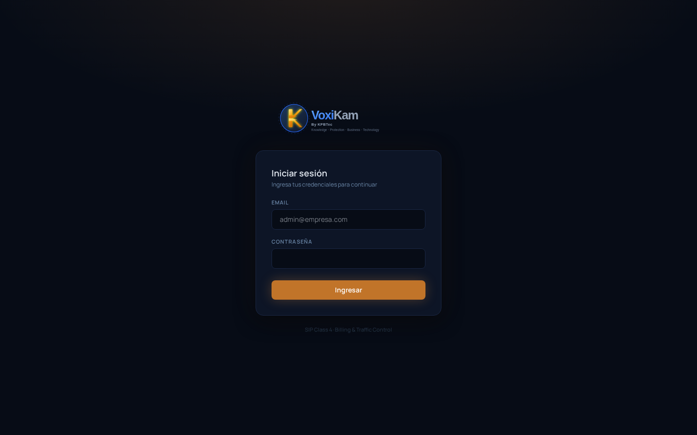

# 1. Primeros pasos

## 1.1 ¿Qué es VoxiKam?

VoxiKam es una plataforma de **billing SIP Class 4**: se encarga del switching de tránsito de llamadas de voz y de la facturación por minuto entre operadores y revendedores (resellers). En otras palabras, es el sistema que enruta el tráfico de voz entre carriers y clientes, y calcula cuánto se factura a cada uno según el consumo real.

## 1.2 Acceder al panel por primera vez

VoxiKam se usa desde el navegador, sin necesidad de instalar ningún programa adicional.

1. Abrí el navegador y entrá a la URL del panel de tu instalación, por ejemplo:

   ```
   http://tu-dominio:7666
   ```

   El puerto (`7666` en el ejemplo) es el que se configuró durante la instalación y puede variar según tu ambiente.

2. Vas a ver el formulario de **Iniciar sesión**, con los campos **Email** y **Contraseña**:

   

3. Ingresá el **email** y la **contraseña** de administrador. Estas credenciales se generan automáticamente durante la instalación (`deploy.sh`) y quedan guardadas en el servidor en:

   ```
   /voxikam-install/logs-configs/credentials.conf
   ```

   Si es tu primer ingreso, pedile este dato a la persona que instaló el sistema o revisá ese archivo directamente en el servidor.

4. Hacé clic en **Ingresar**.

## 1.3 Dos vistas según tu rol

Una vez dentro, el panel que ves depende de qué tipo de usuario sos:

- **Admin**: es el operador que administra todo el sistema. Ve y gestiona carriers, clientes/resellers, tarifas, facturación, reportes y la configuración general de la plataforma.
- **Cliente / Reseller**: cada cliente accede con sus propias credenciales y ve únicamente su propia información (sus llamadas, sus tarifas, sus facturas), sin acceso a los datos de otros clientes.

Ambos roles inician sesión desde la misma pantalla de login; el sistema muestra automáticamente el panel que corresponde según el usuario.

Ver capítulo Dashboard para conocer la pantalla principal luego de iniciar sesión.
