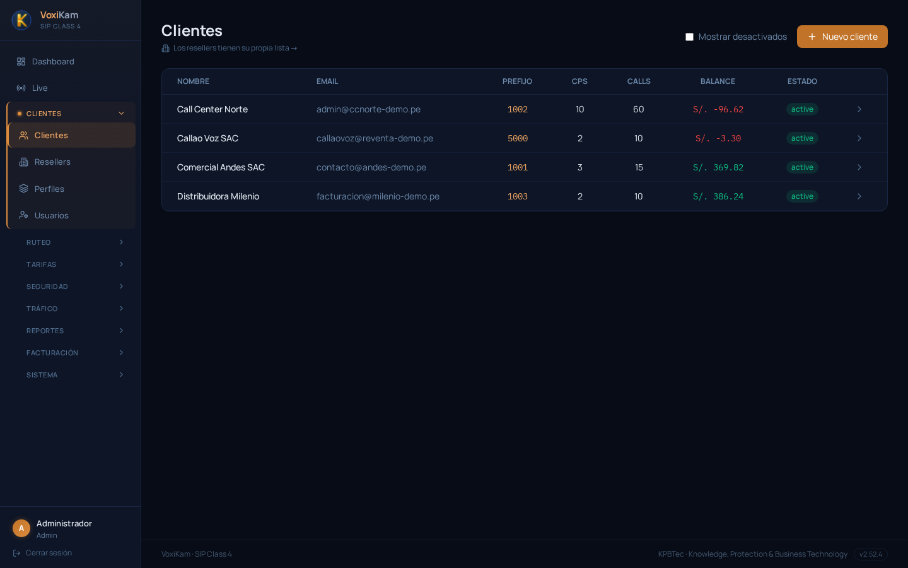
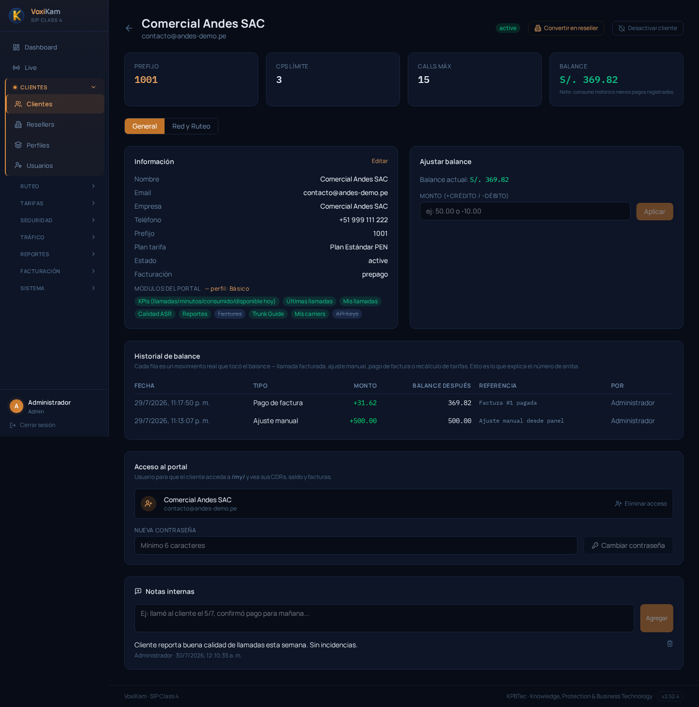
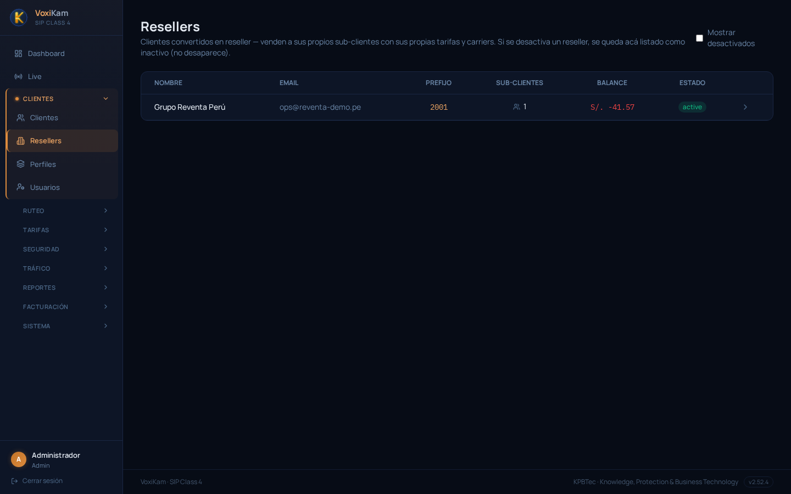

# 3. Clientes

## 3.1. Qué es un "cliente" en VoxiKam

En VoxiKam, un **cliente** es un trunk SIP: una cuenta independiente con su propia configuración de facturación, límites de tráfico, seguridad y acceso al portal. Cada llamada que entra a la plataforma se asocia a un cliente específico, y es esa asociación la que determina con qué tarifa se factura, qué carriers de salida puede usar, y si tiene o no permitido cursar la llamada.

Por esto el cliente es la entidad central del sistema: casi todo lo demás en VoxiKam (tarifas, carriers, CDRs, facturas, alertas de consumo) existe en función de un cliente. Antes de tocar cualquier otro módulo del panel de administración, conviene tener claro qué cliente es, cómo está configurado y cuál es su estado actual.

## 3.2. El listado de clientes

El listado se encuentra en **Clientes → Clientes** y muestra de un vistazo todos los clientes dados de alta, con la información mínima necesaria para monitorear la cuenta sin entrar a cada ficha.

Por cada cliente el listado muestra:

- **Nombre** y **email** de contacto.
- **Prefijo** (techprefix): el identificador único que el sistema usa para reconocer a qué cliente pertenece cada llamada entrante.
- **CPS**: el límite de llamadas por segundo configurado para ese cliente.
- **Calls**: el límite de llamadas simultáneas.
- **Balance**: el saldo actual, en la moneda del cliente. El balance se muestra en color según su signo — en **rojo** si es negativo (el cliente debe dinero, como Call Center Norte con S/.-96.62 o Callao Voz SAC con S/.-3.30) y en **verde** si es positivo (Comercial Andes SAC con S/.369.82, Distribuidora Milenio con S/.386.24). Este código de color permite detectar de un vistazo qué cuentas requieren atención de cobranza.
- **Estado**: si el cliente está activo o desactivado. Los cuatro clientes del ejemplo figuran como `active`.

Desde este listado se accede a la ficha de detalle de cada cliente haciendo clic sobre la fila correspondiente. También hay un acceso directo al listado de resellers, que se explica en la sección 3.5.

## 3.3. La ficha de detalle de un cliente

Al entrar a un cliente desde el listado se abre su ficha de detalle, con toda la configuración de ese trunk SIP. La imagen siguiente corresponde al cliente **Comercial Andes SAC**:

En la parte superior de la ficha hay un resumen rápido con los datos más consultados:

- **Prefijo**: `1001`, el techprefix de este cliente.
- **CPS límite**: `3`, el máximo de llamadas por segundo que puede cursar.
- **Calls máx**: el límite de llamadas simultáneas permitidas.
- **Balance**: S/.369.82, el saldo actual.

Debajo, la sección **Información** reúne los datos de configuración del cliente:

- **Nombre**, **email**, **empresa** y **teléfono** de contacto.
- **Prefijo**: el mismo techprefix mostrado arriba.
- **Plan tarifa**: el plan de tarifas asignado a este cliente (en este caso, "Plan Estándar PEN"), que define cuánto se le cobra por minuto según destino.
- **Estado**: activo o desactivado.
- **Facturación**: si el cliente opera bajo balance **prepago** o **postpago**.
- **Módulos del portal**: el perfil de módulos asignado, que define qué secciones ve este cliente cuando entra a su propio portal (KPIs, últimas llamadas, calidad ASR, reportes, trunk guide, sus carriers, API keys, etc.). Los módulos que aparecen tachados están deshabilitados para este cliente según su perfil.

A la derecha, la sección **Ajustar balance** permite registrar manualmente un crédito o débito sobre el saldo del cliente.

Más abajo, el **Historial de balance** es la bitácora de todos los movimientos que afectaron el saldo: pagos de factura, ajustes manuales, recálculos de tarifas, etc. Cada fila indica fecha, tipo de movimiento, monto, balance resultante después del movimiento, una referencia y quién lo realizó. En el ejemplo se ve un pago de factura (+31.62) y un ajuste manual de recarga (+500.00), que son los movimientos que explican el balance actual de S/.369.82.

Finalmente, la sección **Notas internas** funciona como una bitácora de seguimiento para el equipo interno — comentarios sobre el cliente que no son visibles para él, como por ejemplo "Cliente reporta buena calidad de llamadas esta semana. Sin incidencias."

## 3.4. Otras configuraciones desde la ficha del cliente

Además de lo descrito arriba, desde la ficha del cliente también se gestionan:

- Las **IPs autorizadas** del cliente (lista blanca): cualquier llamada que llegue desde una IP no incluida en esta lista es rechazada. Esta configuración se detalla en el capítulo de Seguridad.
- Los **carriers de salida** asignados al cliente, con su orden de prioridad y failover entre ellos. Se detalla en el capítulo de Carriers.
- El **perfil de módulos** del portal, que ya vimos resumido en la ficha pero que se administra en detalle desde el capítulo de Perfiles.

## 3.5. Clientes como reseller

Cualquier cliente puede marcarse como **reseller** (revendedor). Al convertirse en reseller, el cliente obtiene su propio panel para dar de alta y administrar sub-clientes, con sus propias tarifas y carriers, de forma similar a como el administrador general gestiona a sus clientes.

El listado de resellers se ve así:

En el ejemplo hay un solo reseller, **Grupo Reventa Perú**, con techprefix `2001`, 1 sub-cliente a su cargo y un balance de S/.-41.57.

La administración del panel de reseller y de sus sub-clientes se cubre en detalle en el capítulo dedicado a Resellers.
