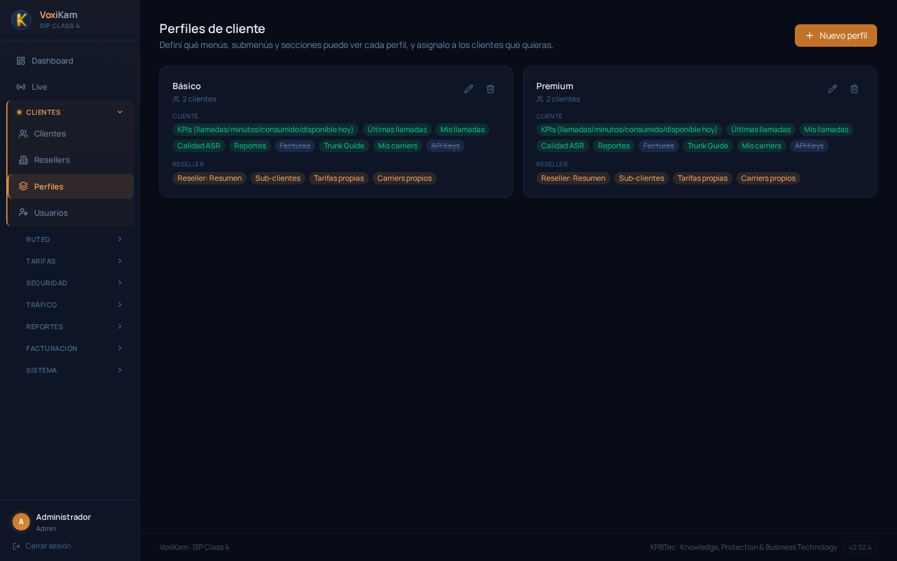

# 4. Perfiles de cliente

## 4.1 Qué son los Perfiles

Un **Perfil** es un conjunto de módulos del portal cliente que se puede asignar a **varios clientes a la vez**. En lugar de entrar cliente por cliente a habilitar o deshabilitar cada módulo del portal, el operador define un perfil una sola vez y lo asigna a todos los clientes que deban compartir esa misma configuración.

La ventaja principal es el **control centralizado**: si más adelante hay que cambiar qué módulos ve un grupo de clientes, alcanza con editar el perfil una vez. El cambio se aplica automáticamente a todos los clientes que tengan ese perfil asignado, sin necesidad de tocar la configuración individual de cada uno.

Los módulos que se pueden controlar desde un perfil son:

- **Resumen**, con sus sub-partes:
  - **KPIs**
  - **Últimas llamadas**
- **Mis llamadas**
- **Calidad ASR**
- **Reportes**
- **Facturas**
- **Trunk Guide**
- **Mis carriers**
- **API Keys**

Cada uno de estos módulos puede estar **habilitado o deshabilitado** de forma independiente dentro de un perfil.

## 4.2 Pantalla de Perfiles

La sección **Perfiles** (menú lateral, dentro de **Clientes**) muestra el listado de perfiles existentes, con la cantidad de clientes que tiene asignados cada uno y los módulos que incluye.

En el ejemplo de la captura hay dos perfiles configurados:

- **Básico** — asignado a **2 clientes**. Incluye Resumen (KPIs y Últimas llamadas), Mis llamadas, Calidad ASR, Reportes y Trunk Guide, Mis carriers, pero tiene **Facturas** y **API Keys** deshabilitados (aparecen tachados en el listado). Es un perfil pensado para clientes con acceso limitado, que no deben ver su información de facturación ni generar claves de API.
- **Premium** — asignado a **2 clientes**. Tiene **todos los módulos habilitados**, incluyendo Facturas y API Keys, sin ninguna restricción.

El tachado sobre el nombre de un módulo en el listado es la forma visual de identificar rápidamente qué está deshabilitado en cada perfil, sin necesidad de entrar a editarlo.

## 4.3 Crear o editar un perfil

1. Ir a **Clientes → Perfiles**.
2. Para crear uno nuevo, hacer clic en **Nuevo perfil**. Para modificar uno existente, usar el ícono de edición sobre la tarjeta del perfil correspondiente.
3. Ponerle un nombre identificable al perfil (por ejemplo, "Básico" o "Premium").
4. Marcar o desmarcar cada módulo según corresponda:
   - Resumen (y, dentro de él, KPIs y Últimas llamadas)
   - Mis llamadas
   - Calidad ASR
   - Reportes
   - Facturas
   - Trunk Guide
   - Mis carriers
   - API Keys
5. Guardar los cambios.

> **Importante:** cualquier cambio hecho sobre un perfil impacta de inmediato en **todos los clientes** que tengan ese perfil asignado. No hace falta volver a asignarlo ni reconfigurar nada por cliente: el perfil es una configuración compartida, y editarlo una vez actualiza el portal de todos los clientes vinculados a él.

Por eso es recomendable pensar los perfiles como "plantillas" reutilizables (por ejemplo, uno para clientes básicos y otro para clientes premium) en lugar de crear un perfil distinto para cada cliente individual.

## 4.4 Clientes sin perfil asignado

Un cliente **no está obligado** a tener un perfil asignado. Si un cliente no tiene ningún perfil vinculado, no hereda la configuración de módulos de ningún perfil compartido: en su lugar, usa su **propia configuración individual** de módulos (overrides propios), definida directamente sobre ese cliente.

Esto es útil para casos particulares que no encajan en ninguno de los perfiles existentes, donde se necesita una combinación de módulos distinta a la de "Básico" o "Premium" sin tener que crear un perfil nuevo solo para un cliente.

En resumen:

- **Cliente con perfil asignado** → ve los módulos que ese perfil tiene habilitados, y cualquier cambio futuro al perfil lo afecta automáticamente.
- **Cliente sin perfil asignado** → ve los módulos según su propia configuración individual, independiente de cualquier perfil.
