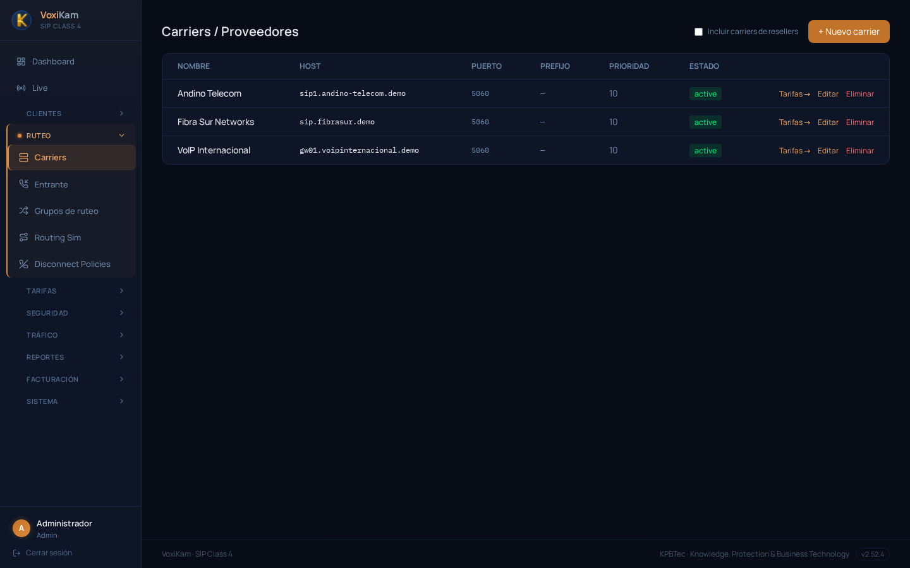
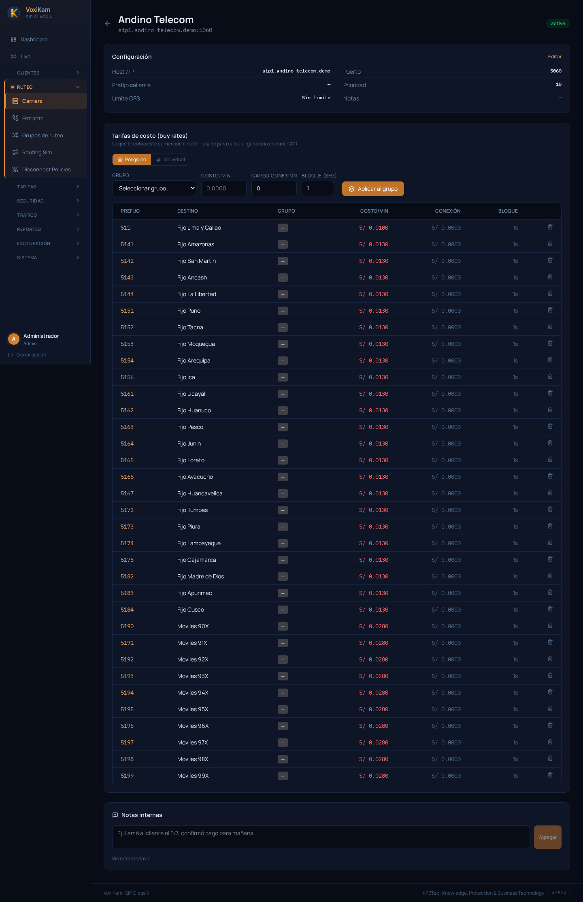
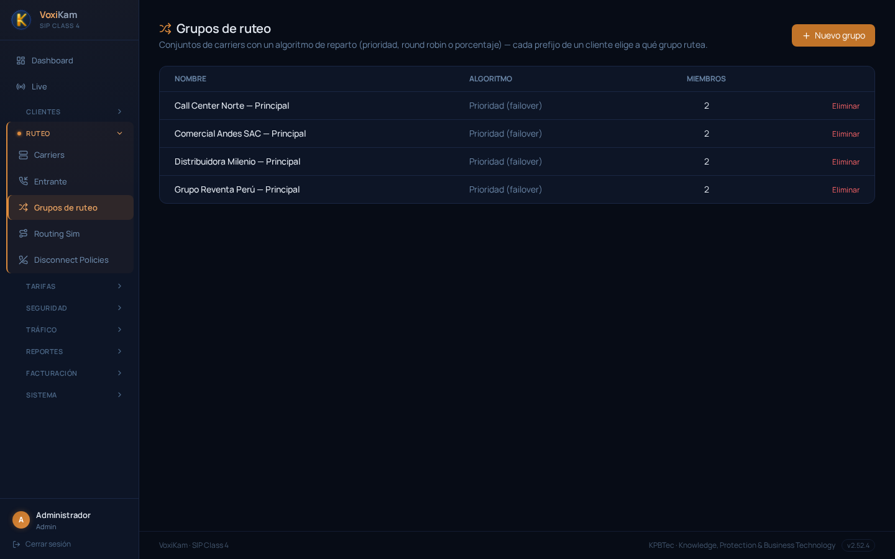

# 5. Carriers y grupos de ruteo

## 5.1 Qué es un Carrier

Un **Carrier** es el proveedor mayorista de terminación por el que VoxiKam saca las llamadas hacia la red pública (fijos y móviles). En términos SIP, es el gateway de salida al que la plataforma le entrega el tráfico: host/IP, puerto SIP y, opcionalmente, un prefijo saliente que se antepone al número marcado.

Cada Carrier tiene su propia **tarifa de costo (buy rate)**: lo que ese proveedor le cobra a VoxiKam por minuto según el destino. Esta tarifa de compra es la base para calcular la ganancia en cada CDR, comparándola contra la tarifa de venta que se le cobra al cliente.

Un Carrier no se asigna directamente a un cliente. Es una pieza de infraestructura que luego se combina con otros carriers dentro de un **Grupo de ruteo** (ver sección 5.4), que es lo que realmente se conecta a los clientes.

Los Carriers se administran desde **Ruteo → Carriers**.

## 5.2 Listado de Carriers

La pantalla de listado (**Ruteo → Carriers**) muestra todos los carriers dados de alta, con las columnas:

- **Nombre**: identificador del proveedor.
- **Host**: dirección SIP del gateway del carrier.
- **Puerto**: puerto SIP de salida (habitualmente 5060).
- **Prefijo**: prefijo saliente que se antepone al número, si el carrier lo requiere.
- **Prioridad**: valor de referencia del carrier (se usa en combinación con la prioridad configurada dentro de cada grupo de ruteo).
- **Estado**: activo/inactivo.

En el ejemplo de arriba hay tres carriers activos, todos escuchando en el puerto 5060 y con prioridad 10:

| Nombre | Host | Puerto | Prioridad | Estado |
|---|---|---|---|---|
| Andino Telecom | sip1.andino-telecom.demo | 5060 | 10 | active |
| Fibra Sur Networks | sip.fibrasur.demo | 5060 | 10 | active |
| VoIP Internacional | gw01.voipinternacional.demo | 5060 | 10 | active |

Desde cada fila se puede entrar a **Tarifas** (la ficha de tarifas de costo del carrier), **Editar** los datos de conexión o **Eliminar** el carrier. Con el botón **+ Nuevo carrier**, arriba a la derecha, se da de alta uno nuevo. El checkbox **Incluir carriers de resellers** permite mostrar en el mismo listado los carriers que pertenecen a resellers.

## 5.3 Ficha de detalle de un Carrier

Al entrar a un carrier (por ejemplo, haciendo clic en **Tarifas** o en el nombre desde el listado) se ve su ficha completa, dividida en dos bloques: **Configuración** y **Tarifas de costo (buy rates)**.

**Configuración** muestra los datos de conexión del carrier:

- **Host / IP**: dirección del gateway (`sip1.andino-telecom.demo`).
- **Puerto**: puerto SIP (`5060`).
- **Prefijo saliente**: prefijo a anteponer al marcar, si aplica.
- **Prioridad**: prioridad del carrier.
- **Límite CPS**: tope de llamadas por segundo hacia este carrier (o "Sin límite").
- **Notas**: campo libre.

Estos datos se modifican con el botón **Editar**, en la esquina superior derecha del bloque.

**Tarifas de costo (buy rates)** es la tabla donde se carga cuánto le cobra el carrier a la plataforma por minuto, según el prefijo de destino. Esta tarifa es la que usa VoxiKam para calcular la ganancia en cada CDR (la diferencia entre lo que paga al carrier y lo que cobra al cliente).

La tabla lista, para cada prefijo:

- **Prefijo**: el código de destino (por ejemplo `511`, `5190`).
- **Destino**: la descripción del prefijo (por ejemplo "Fijo Lima y Callao", "Moviles 90X").
- **Grupo**: agrupación opcional del prefijo.
- **Costo/min**: el costo por minuto que cobra el carrier.
- **Conexión**: cargo fijo por establecimiento de llamada, si el carrier lo aplica.
- **Bloque**: la unidad de facturación del carrier, en segundos (por ejemplo, bloques de 1s).

En el carrier **Andino Telecom** del ejemplo, la tarifa de costo cubre los ~34 destinos peruanos habituales, agrupados en tres niveles de precio:

| Destino | Costo/min |
|---|---|
| Fijo Lima y Callao | S/. 0.0100 |
| Fijo provincias (Amazonas, San Martín, Áncash, La Libertad, Puno, Tacna, Moquegua, Arequipa, Ica, Ucayali, Huánuco, Pasco, Junín, Loreto, Ayacucho, Huancavelica, Tumbes, Piura, Lambayeque, Cajamarca, Madre de Dios, Apurímac, Cusco) | S/. 0.0130 |
| Móviles (90X a 99X) | S/. 0.0280 |

Todos los destinos de este carrier facturan en bloques de 1 segundo y sin cargo de conexión (S/. 0.0000).

Para cargar tarifas nuevas, la ficha ofrece dos modos, con pestañas arriba de la tabla:

1. **Por grupo**: se elige un grupo de prefijos en el desplegable **Grupo**, se completan **Costo/min**, **Cargo conexión** y **Bloque (seg)**, y se presiona **Aplicar al grupo** para actualizar de una sola vez todos los prefijos de ese grupo.
2. **Individual**: para editar el costo de un prefijo puntual, uno por uno.

Al final de la ficha hay un bloque de **Notas internas**, donde se puede dejar constancia de gestiones con el carrier (por ejemplo, confirmaciones de pago o incidencias), escribiendo el texto y presionando **Agregar**.

## 5.4 Grupos de ruteo (Carrier Groups)

Un **Grupo de ruteo** (Carrier Group) es el mecanismo real que conecta a un cliente con uno o varios carriers. En VoxiKam **no se asigna un carrier suelto a un cliente**: se arma (o se reutiliza) un grupo de ruteo, y es ese grupo el que queda vinculado al cliente.

Un grupo de ruteo puede tener uno o más carriers como miembros, cada uno con su propia prioridad dentro del grupo. Cuando el grupo tiene 2 o más carriers, se define un **algoritmo de reparto** que determina cómo se distribuye el tráfico entre ellos:

- **Prioridad (failover)**: las llamadas se intentan primero por el carrier de mayor prioridad; si ese carrier falla (no responde, rechaza la llamada, etc.), VoxiKam prueba automáticamente con el siguiente carrier del grupo. Es el algoritmo pensado para redundancia: un carrier de respaldo entra en juego solo cuando el principal falla.
- **Round Robin**: el tráfico se reparte de forma equitativa entre los carriers miembros del grupo, llamada por llamada, en rotación.
- **Porcentaje**: el tráfico se reparte entre los carriers miembros según un porcentaje configurable para cada uno (por ejemplo, 70% para un carrier y 30% para otro).

Los Grupos de ruteo se administran desde **Ruteo → Grupos de ruteo**.

El listado muestra, para cada grupo:

- **Nombre**: identifica al grupo, generalmente asociado al cliente que lo usa (por ejemplo, "Comercial Andes SAC — Principal").
- **Algoritmo**: el algoritmo de reparto configurado (Prioridad, Round Robin o Porcentaje).
- **Miembros**: la cantidad de carriers que integran el grupo.

En el ejemplo hay cuatro grupos de ruteo dados de alta, uno por cliente, todos con algoritmo **Prioridad (failover)** y 2 carriers miembros cada uno:

| Nombre | Algoritmo | Miembros |
|---|---|---|
| Call Center Norte — Principal | Prioridad (failover) | 2 |
| Comercial Andes SAC — Principal | Prioridad (failover) | 2 |
| Distribuidora Milenio — Principal | Prioridad (failover) | 2 |
| Grupo Reventa Perú — Principal | Prioridad (failover) | 2 |

Con esta configuración, cada cliente tiene su propio grupo con un carrier principal y uno de respaldo: si el carrier principal falla, VoxiKam enruta automáticamente la llamada por el segundo carrier del grupo, sin intervención manual.

Para crear un grupo nuevo se usa el botón **+ Nuevo grupo**, arriba a la derecha del listado. Desde ahí se define el nombre, el algoritmo de reparto y se agregan los carriers miembros con su prioridad (o porcentaje, según el algoritmo elegido).
