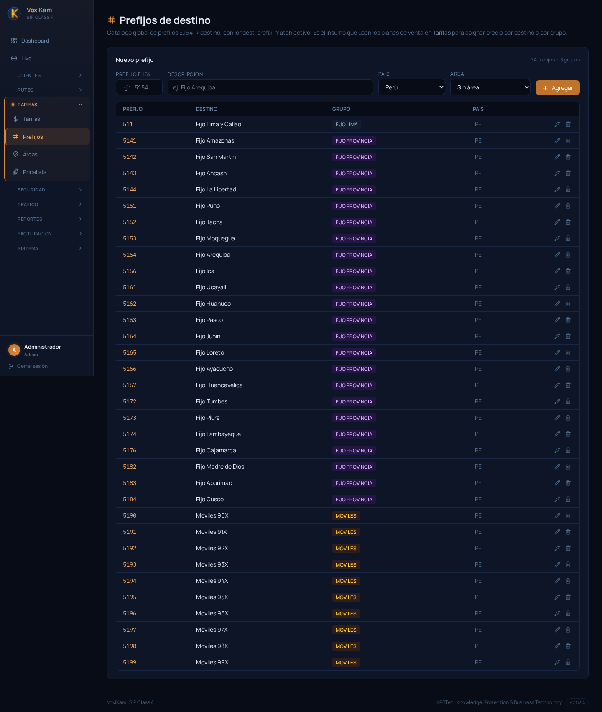
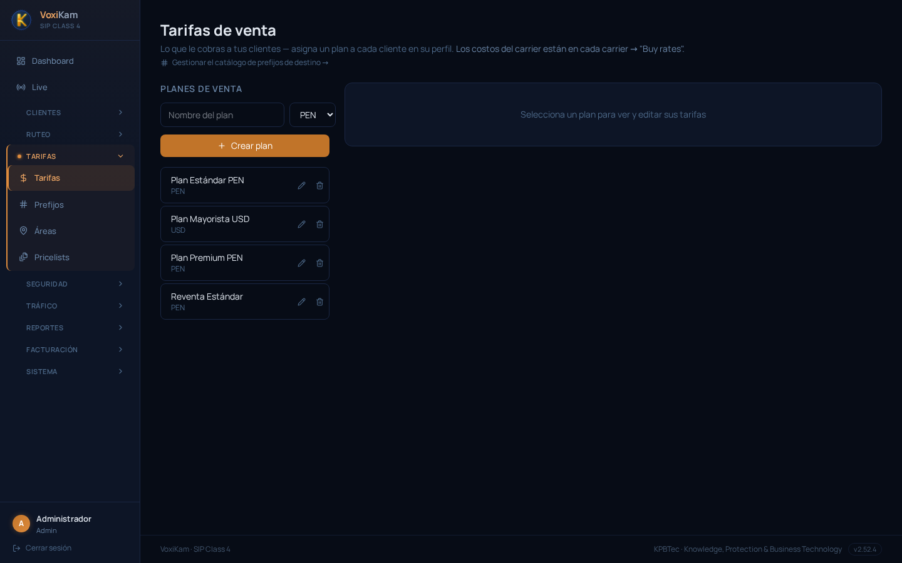
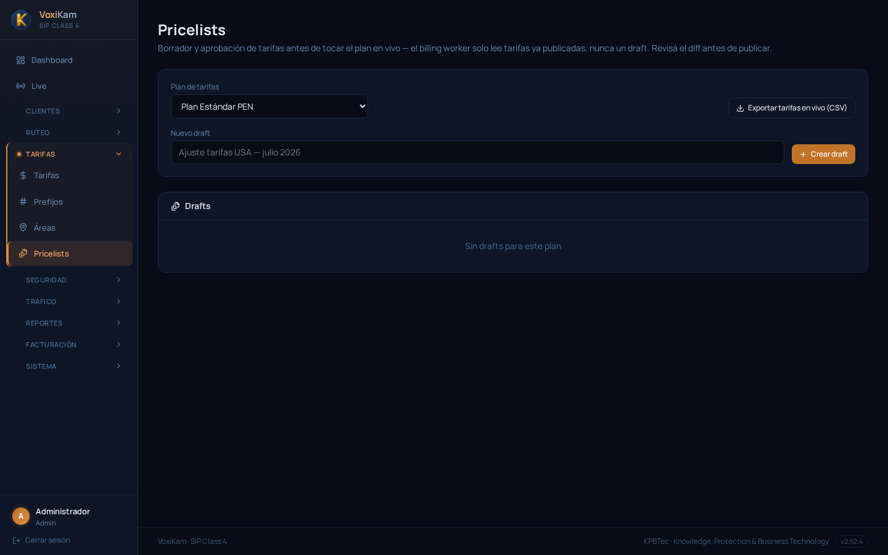
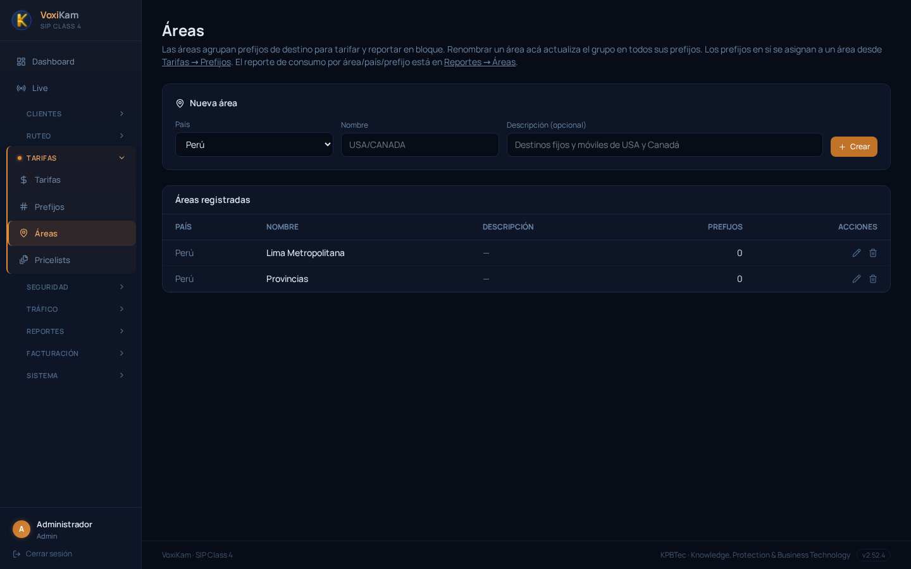

# 6. Tarifas, prefijos y áreas

## 6.1 Costo de compra vs. precio de venta

En el capítulo anterior viste los **Carriers**: los proveedores a los que VoxiKam les compra minutos de tránsito, y las tarifas de compra que ellos definen por prefijo. Ese es un solo lado de la ecuación.

El otro lado es lo que **cada cliente paga** por sus llamadas. Eso no lo define el carrier, sino un **Plan de tarifas** (Rate Plan) que vos armás y asignás al cliente. Cada cliente tiene un plan de tarifas asignado, y ese plan es el que determina cuánto se le factura por cada llamada, prefijo por prefijo.

La diferencia entre ambos valores es el **margen** de la plataforma:

```
Margen = Precio de venta (Rate Plan del cliente) − Costo de compra (tarifa del Carrier)
```

Por eso es tan importante mantener bien cargados tanto los costos de compra (capítulo de Carriers) como los precios de venta (este capítulo): cualquier error en uno de los dos lados infla o borra el margen sin que se note a simple vista.

## 6.2 Prefijos: el catálogo de destinos

Antes de poder armar una tarifa, tanto de compra como de venta, necesitás un catálogo de **prefijos**: los códigos E.164 de destino sobre los que se cargan los precios.



Cada prefijo tiene:

- **Código**: el prefijo E.164 propiamente dicho (por ejemplo, un rango de un número fijo o móvil).
- **Nombre de destino**: una descripción legible del destino (por ejemplo "Fijo Lima").
- **Grupo**: la categoría a la que pertenece ese destino (por ejemplo "Fijo Lima", "Fijo Provincia" o "Móviles").

En la captura de ejemplo el catálogo tiene 34 prefijos peruanos organizados en esas 3 categorías, cubriendo fijos de Lima, fijos de provincia y los rangos móviles (90X a 99X).

Este catálogo es **compartido**: tanto las tarifas de venta de los planes como las tarifas de compra de los carriers se cargan sobre los mismos prefijos. Por eso, si modificás un prefijo (su código, su nombre o el grupo al que pertenece), ese cambio impacta en **todos los planes de tarifas y todos los carriers** que lo referencian. Manejá estos cambios con cuidado, sobre todo en un sistema en producción.

## 6.3 Planes de tarifas (Rate Plans)

Los **Planes de tarifas** son el catálogo de precios de venta. Cada plan define, para cada prefijo del catálogo, tres valores:

- **Precio por minuto**: lo que se cobra por cada minuto de conversación en ese destino.
- **Cargo de conexión**: un monto fijo que se cobra al establecerse la llamada, además del costo por minuto.
- **Tiempo mínimo facturable**: la duración mínima que se factura aunque la llamada dure menos.



En la captura de ejemplo hay 4 planes dados de alta:

- **Plan Estándar PEN**: el plan base para clientes que facturan en soles.
- **Plan Mayorista USD**: pensado para clientes de mayor volumen que facturan en dólares.
- **Plan Premium PEN**: un plan con condiciones distintas (probablemente mejores tarifas o destinos adicionales) para clientes de otro segmento.
- **Reventa Estándar**: el plan propio de un reseller, que este a su vez usa como base para tarifar a sus propios clientes.

Cada cliente tiene **un** plan de tarifas asignado. Al momento de facturar una llamada, VoxiKam busca el prefijo de destino en ese plan y aplica el precio por minuto, el cargo de conexión y el mínimo facturable que correspondan.

## 6.4 Pricelists: modificar tarifas sin tocar producción

Editar un plan de tarifas prefijo por prefijo, a mano, es lento y arriesgado cuando hay que actualizar cientos de líneas a la vez (por ejemplo, tras una renegociación general de precios). Para eso existen las **Pricelists**: un sistema de borradores que permite preparar una lista de precios nueva **sin afectar lo que está en producción**, y recién aplicarla cuando esté lista.



El flujo de trabajo es:

1. Entrá a **Pricelists** y elegí el **plan de tarifas** sobre el que querés trabajar (en la captura de ejemplo, "Plan Estándar PEN"). Si el plan no tiene ningún borrador pendiente, vas a ver solo las opciones para empezar uno nuevo.
2. Creá un **draft** (borrador) nuevo. Tenés dos caminos:
   - Armarlo manualmente, agregando o editando líneas de precio por prefijo.
   - **Importarlo desde un archivo CSV**, lo que es la forma más rápida de cargar o actualizar precios en bloque.
3. Con el draft creado, revisá con calma los precios cargados. Como todavía es un borrador, los cambios **no afectan** las llamadas que se están facturando en ese momento con el plan de producción.
4. Si necesitás compartir el borrador para que alguien más lo revise, o volver a cargarlo desde otro archivo, podés **exportarlo a CSV**.
5. Cuando el borrador está validado y listo, **publicalo**. Recién en ese momento los nuevos precios reemplazan a los que estaban vigentes en el plan de tarifas, y empiezan a aplicarse a las llamadas siguientes.

Este flujo de draft → revisión → publicación es la forma recomendada de actualizar tarifas existentes, porque evita que un error de carga (una coma corrida, una línea duplicada, un prefijo mal escrito) impacte directamente en la facturación de los clientes.

## 6.5 Áreas: agrupar prefijos por zona geográfica

Además del **grupo** de cada prefijo (Fijo Lima, Fijo Provincia, Móviles), VoxiKam permite armar un agrupador adicional llamado **Áreas**, pensado para análisis geográfico más que para la tarifación en sí.



Una **Área** agrupa uno o más prefijos bajo una misma zona. En la captura de ejemplo hay 2 áreas creadas, "Lima Metropolitana" y "Provincias", aunque todavía sin prefijos asignados (0 prefijos cada una).

Para que una Área sea útil hay que asignarle los prefijos que correspondan a esa zona (por ejemplo, los prefijos del grupo "Fijo Lima" a la zona "Lima Metropolitana"). Una vez asignados, las Áreas permiten ver la rentabilidad de la operación agrupada por zona geográfica, en lugar de prefijo por prefijo. Ver el capítulo de Reportes para el detalle de cómo se usan las Áreas en los reportes de rentabilidad.
