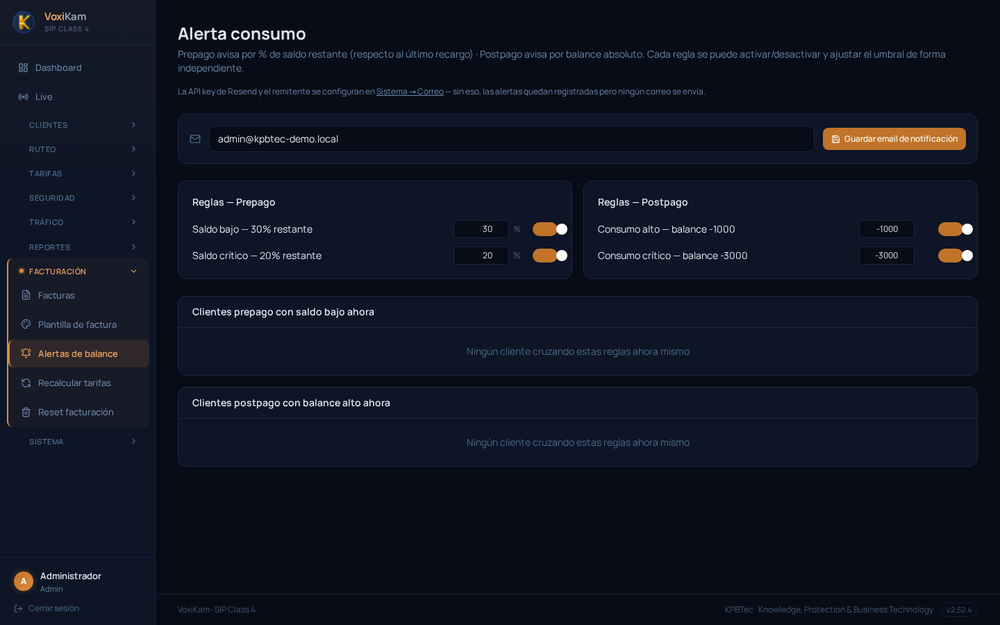
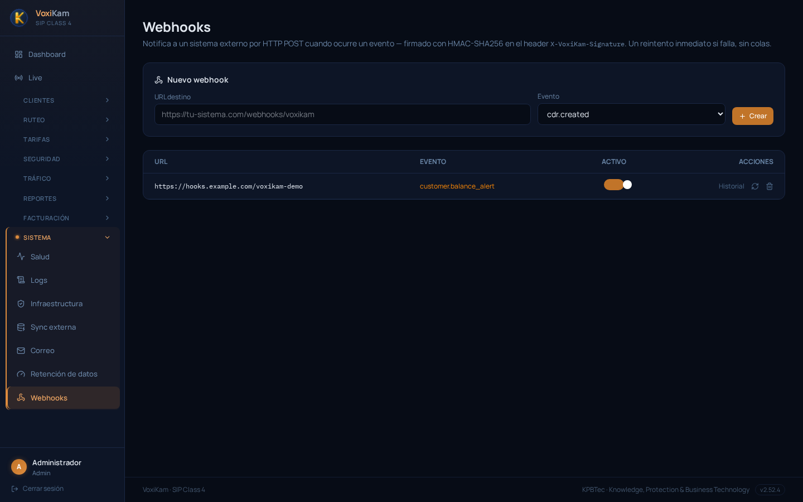
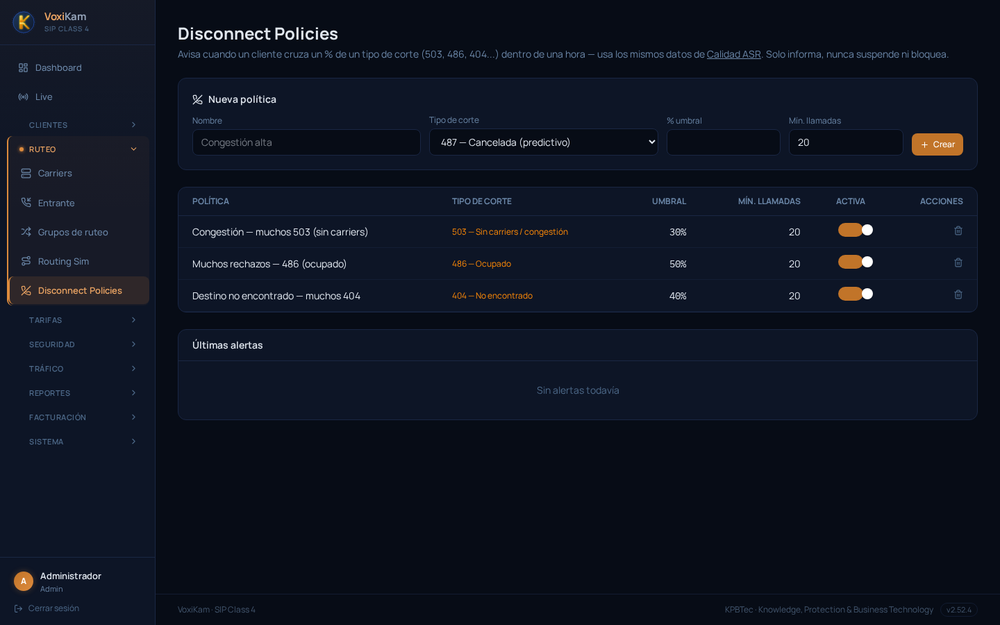
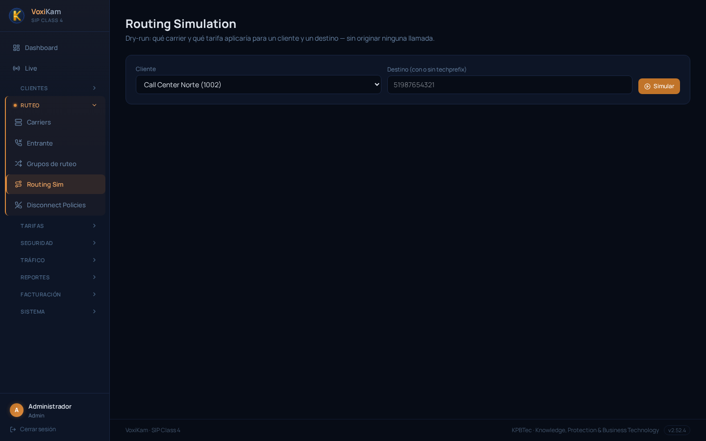

# 10. Alertas, Webhooks y Ruteo

Los capítulos anteriores cubrieron cómo se factura (Tarifas) y por dónde sale el tráfico (Carriers). Este capítulo cubre las herramientas que vigilan que todo eso siga funcionando como corresponde: avisos de saldo antes de que un cliente se quede sin crédito o se endeude de más, integraciones con sistemas externos vía Webhooks, detección de problemas sistémicos de calidad con Disconnect Policies, y un simulador de ruteo para verificar tarifas y carriers sin originar tráfico real.

## 10.1 Alertas de consumo

La pantalla **Alerta consumo** (menú **Facturación → Alertas de balance**) define cuándo VoxiKam debe avisar que el balance de un cliente está entrando en zona de riesgo. La lógica es distinta según el tipo de cliente:

- **Prepago**: la alerta se dispara por **% de saldo restante respecto a la última recarga**. Si un cliente recargó S/. 100 y su saldo bajó a S/. 30, cruzó el umbral del 30%.
- **Postpago**: la alerta se dispara por **balance absoluto negativo**. Como estos clientes no recargan sino que consumen contra una línea de crédito, el umbral se define directamente en soles/dólares negativos (por ejemplo, -1000).

Esta diferencia tiene sentido operativo: al prepago hay que avisarle que se está por quedar sin saldo (para que recargue antes de que se corte el servicio); al postpago hay que avisarle a **la propia operación** que un cliente está acumulando una deuda importante, antes de que se vuelva incobrable.

En la captura de ejemplo hay 4 reglas configuradas, dos por cada tipo de cliente:

| Regla | Tipo | Umbral | Estado |
|---|---|---|---|
| Saldo bajo — 30% restante | Prepago | 30% del último recargo | Activa |
| Saldo crítico — 20% restante | Prepago | 20% del último recargo | Activa |
| Consumo alto — balance -1000 | Postpago | Balance ≤ -1000 | Activa |
| Consumo crítico — balance -3000 | Postpago | Balance ≤ -3000 | Activa |

Cada regla tiene su propio campo de umbral (el % para prepago, el balance para postpago) y su propio interruptor de **activar/desactivar**, de forma independiente. Esto permite, por ejemplo, tener activa solo la alerta crítica de postpago sin la de consumo alto, o ajustar el umbral de 30% a 40% sin tocar la regla de saldo crítico.

Debajo de las reglas hay dos paneles de estado en vivo:

- **Clientes prepago con saldo bajo ahora**: lista los clientes que en este momento están cruzando alguna de las reglas de prepago.
- **Clientes postpago con balance alto ahora**: lista los clientes que en este momento están cruzando alguna de las reglas de postpago.

En la captura de ejemplo ambos paneles muestran "Ningún cliente cruzando estas reglas ahora mismo", es decir que ningún cliente está, en ese momento, por debajo de los umbrales configurados.

Para que las alertas lleguen por correo, hace falta configurar un **email de notificación** (campo de arriba, con el botón **Guardar email de notificación**) y, además, tener cargada la API key de Resend y el remitente en **Sistema → Correo**. Si esa configuración de correo falta, las alertas igual quedan registradas dentro de VoxiKam, pero ningún correo se envía.

## 10.2 Webhooks

Los **Webhooks** (menú **Sistema → Webhooks**) permiten que VoxiKam avise a un sistema externo, por HTTP POST, cada vez que ocurre un evento relevante dentro de la plataforma. Es el mecanismo pensado para integrar VoxiKam con herramientas propias: por ejemplo, notificar a un CRM cuando se paga una factura, actualizar un dashboard interno cuando un cliente cambia de estado, o disparar un aviso propio (SMS, Slack, ticket) cuando un cliente cruza una alerta de balance.

Cada solicitud que envía VoxiKam va firmada con **HMAC-SHA256** en el header `X-VoxiKam-Signature`, para que el sistema receptor pueda verificar que la notificación realmente vino de VoxiKam y no fue falsificada. Si la entrega falla, VoxiKam hace **un reintento inmediato** — no hay cola de reintentos ni reenvíos programados más allá de ese segundo intento, así que conviene que la URL de destino esté siempre disponible y responda rápido.

Para dar de alta un webhook nuevo:

1. Entrá a **Sistema → Webhooks**.
2. En el bloque **Nuevo webhook**, completá la **URL destino**: la dirección de tu sistema externo que va a recibir el POST (por ejemplo, `https://tu-sistema.com/webhooks/voxikam`).
3. Elegí el **Evento** al que querés suscribirte, en el desplegable (por ejemplo, la creación de un CDR, un cambio de estado de cliente, el pago de una factura o el cruce de una alerta de balance del cliente).
4. Presioná **Crear**.

El webhook queda listado en la tabla de abajo, con columnas **URL**, **Evento**, **Activo** (interruptor para pausarlo sin borrarlo) y **Acciones** (**Historial** para revisar las entregas realizadas, un botón de reintento manual y uno de eliminar).

En la captura de ejemplo hay 1 webhook activo, apuntando a `https://hooks.example.com/voxikam-demo`, suscripto al evento **customer.balance_alert** — es decir, ese sistema externo recibe un POST automáticamente cada vez que un cliente cruza alguna de las reglas configuradas en **Alerta consumo** (sección anterior). Es un buen ejemplo de cómo se combinan ambas herramientas: la alerta de consumo decide *cuándo* pasa algo, y el webhook lo *propaga* hacia afuera de VoxiKam.

## 10.3 Disconnect Policies

Las **Disconnect Policies** (menú **Ruteo → Disconnect Policies**) atacan un problema distinto al de las alertas de balance: no vigilan el dinero, sino la **calidad agregada del tráfico**. En vez de mirar llamada por llamada, una política mide, dentro de una ventana de una hora, qué porcentaje de las llamadas terminó con determinado código de corte (por ejemplo 503, 486 o 404) y avisa si ese porcentaje supera el umbral configurado.

Cada política se define con estos campos:

- **Nombre**: identificador de la política (por ejemplo "Congestión alta").
- **Tipo de corte**: el código de finalización de llamada sobre el que se mide el porcentaje (por ejemplo 503 — Sin carriers/congestión, 486 — Ocupado, 404 — No encontrado, 487 — Cancelada/predictivo, entre otros disponibles en el desplegable).
- **% umbral**: el porcentaje de llamadas con ese código, dentro de la ventana de una hora, que dispara la alerta.
- **Mín. llamadas**: la cantidad mínima de llamadas que tiene que haber en la ventana para que el porcentaje se considere válido (evita que 2 llamadas de 3 fallidas disparen una alerta por pura casualidad estadística).

En la captura de ejemplo hay 3 políticas activas, todas con un mínimo de 20 llamadas:

| Política | Tipo de corte | Umbral | Mín. llamadas |
|---|---|---|---|
| Congestión — muchos 503 (sin carriers) | 503 — Sin carriers / congestión | 30% | 20 |
| Muchos rechazos — 486 (ocupado) | 486 — Ocupado | 50% | 20 |
| Destino no encontrado — muchos 404 | 404 — No encontrado | 40% | 20 |

Para crear una política nueva, se completan los campos **Nombre**, **Tipo de corte**, **% umbral** y **Mín. llamadas** en el bloque **Nueva política**, y se presiona **Crear**. Cada política tiene su propio interruptor de **Activa** y se puede eliminar desde el ícono correspondiente en la tabla.

Debajo de la tabla, el bloque **Últimas alertas** muestra el historial de disparos: en la captura de ejemplo figura "Sin alertas todavía", porque ninguna política superó su umbral en ese momento.

Un punto importante: las Disconnect Policies **solo informan**, nunca suspenden ni bloquean tráfico ni clientes automáticamente. Son un mecanismo de detección temprana para que el equipo de operaciones investigue manualmente si hay un problema con un carrier o una ruta específica.

Esta herramienta es complementaria a la **Calidad ASR** que se ve en el capítulo de CDRs, no un reemplazo. La Calidad ASR sirve para revisar, bajo demanda, cómo viene rindiendo una ruta o un rango de fechas puntual cuando ya se sospecha un problema. Las Disconnect Policies, en cambio, vigilan de forma continua y automática, y avisan proactivamente ni bien el porcentaje de un tipo de corte se sale de rango — antes incluso de que alguien piense en ir a revisar los CDRs.

## 10.4 Routing Simulation

**Routing Simulation** (menú **Ruteo → Routing Sim**) es una herramienta de *dry-run*: permite elegir un cliente y un número de destino, y ver qué carrier y qué tarifa resultarían de esa combinación **sin originar ninguna llamada real**.

El uso es simple:

1. Entrá a **Ruteo → Routing Sim**.
2. Elegí el **Cliente** en el desplegable (en la captura de ejemplo, "Call Center Norte (1002)").
3. Escribí el **Destino** en el campo correspondiente — acepta el número con o sin techprefix.
4. Presioná **Simular**.

VoxiKam resuelve la simulación exactamente con la misma lógica que usaría para una llamada real: identifica el prefijo del destino, revisa el grupo de ruteo asignado al cliente y el plan de tarifas que le corresponde, y devuelve qué carrier se usaría y qué tarifa se le cobraría — sin que ninguna llamada se origine hacia el carrier.

Esta herramienta es especialmente útil para verificar la configuración **antes** de que un cliente reporte un problema: si acabás de crear un grupo de ruteo, cambiar una tarifa o dar de alta un cliente nuevo, podés simular un destino típico de ese cliente y confirmar que el carrier y el precio que va a resultar son los esperados, en lugar de esperar a que la primera llamada real revele un error de configuración.
