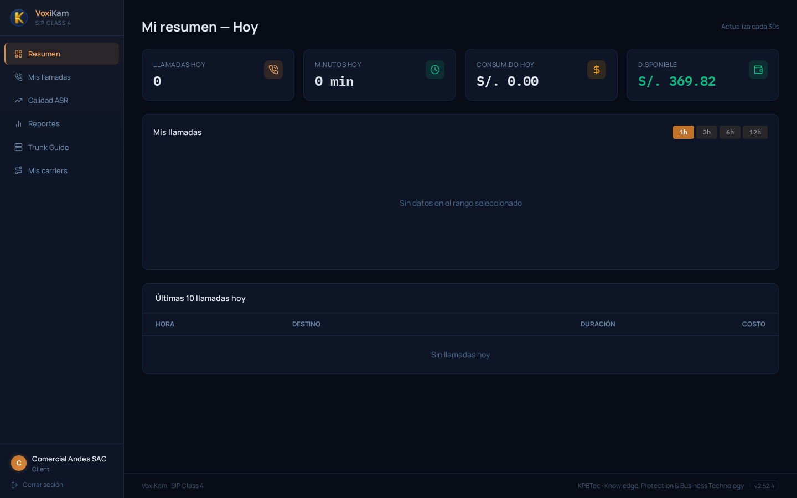
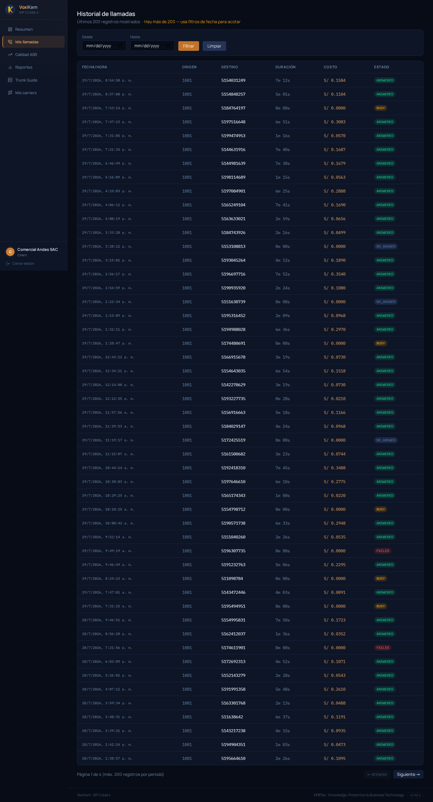
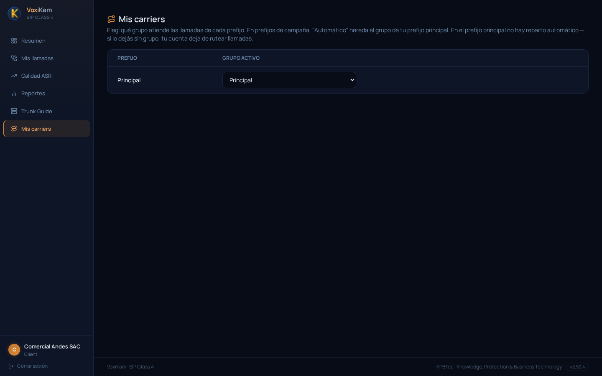
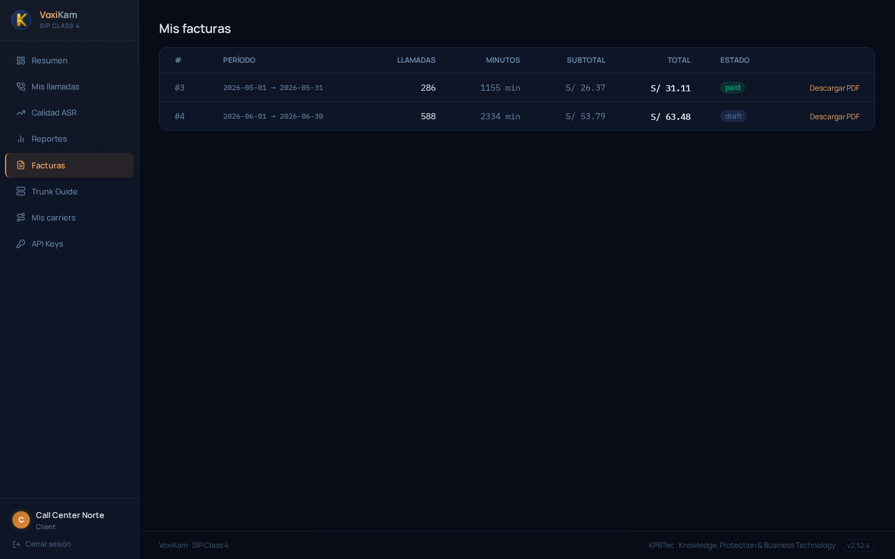
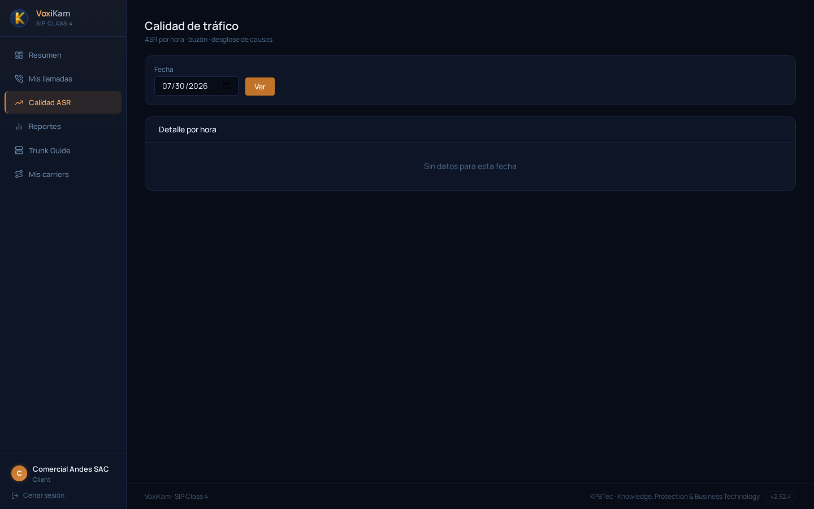
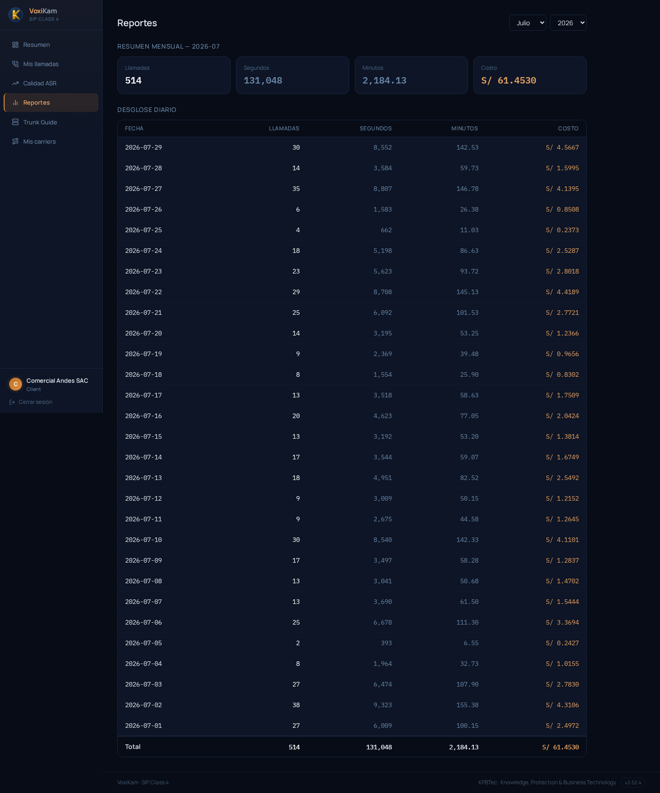
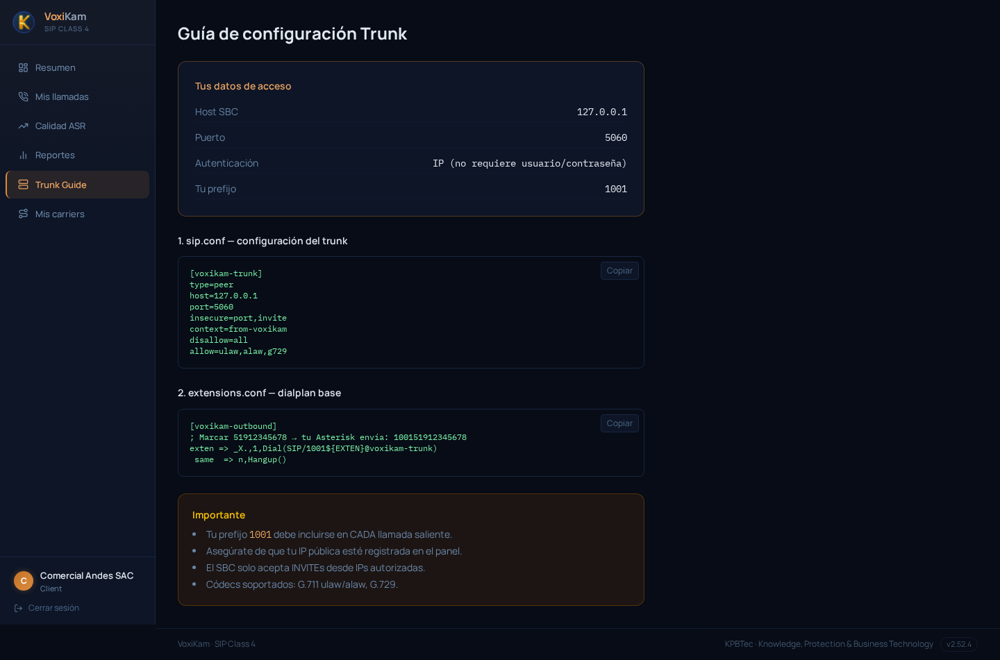
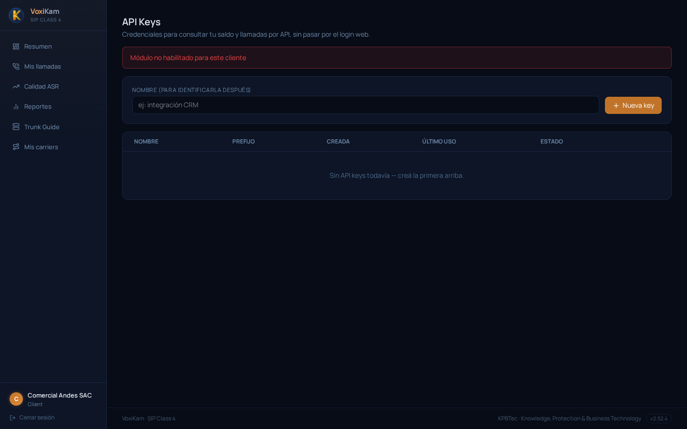
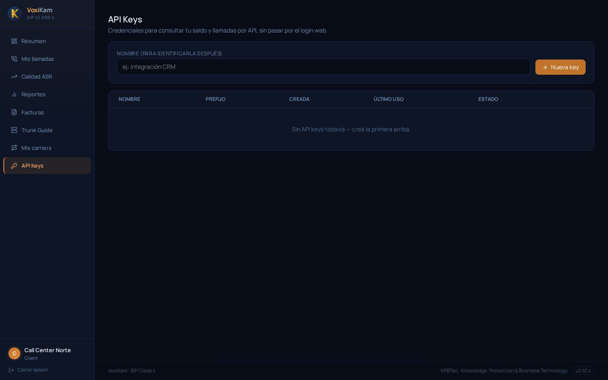

# 12. Portal del cliente

Todos los capítulos anteriores de este manual describen el **panel de administrador**: la vista que usa quien opera VoxiKam (da de alta clientes, configura carriers, tarifas, perfiles, etc.). Este capítulo es distinto: describe el **portal del cliente final**.

Cada cliente de VoxiKam tiene su propio acceso, separado del panel de administrador, donde solo puede ver **su propia información** — nunca la de otros clientes. Desde ahí un cliente puede revisar su consumo, su historial de llamadas, sus facturas (si corresponde) y algunos datos técnicos para configurar su propio equipo.

Qué pantallas ve cada cliente en su portal no es igual para todos: lo define el **Perfil** que el operador le asignó (ver capítulo 4, "Perfiles de cliente"). Por eso, en algunas de las capturas de este capítulo vas a ver módulos como **Facturas** o **API Keys** disponibles, y en otras, deshabilitados — la diferencia está en el perfil de cada cliente, no en un error del sistema. Si a vos, como cliente, te falta alguna de las opciones descriptas acá, comunicate con quien administra tu cuenta de VoxiKam para que revise tu perfil.

## 12.1 Mi resumen

Al entrar al portal, la primera pantalla que ves es **Mi resumen**, con la actividad del día actual.

Esta pantalla muestra cuatro datos principales, cada uno en su propia tarjeta:

- **Llamadas hoy**: cuántas llamadas cursaste en el día.
- **Minutos hoy**: cuántos minutos consumiste en total.
- **Consumido hoy**: cuánto gastaste hasta el momento, en soles.
- **Disponible**: el saldo que todavía tenés disponible para seguir haciendo llamadas.

En la captura de referencia, correspondiente a un día sin actividad todavía, se ven **0 llamadas**, **0 minutos**, **S/. 0.00** consumidos y **S/. 369.82** disponibles de saldo.

Debajo de las tarjetas hay dos secciones adicionales:

- **Mis llamadas**, un gráfico de actividad reciente con botones para cambiar la ventana de tiempo (**1h**, **3h**, **6h**, **12h**). Cuando no hubo llamadas en el rango elegido, muestra el aviso "Sin datos en el rango seleccionado".
- **Últimas 10 llamadas hoy**, una tabla con la hora, el destino, la duración y el costo de tus llamadas más recientes del día. Si todavía no hiciste ninguna llamada, muestra "Sin llamadas hoy".

Esta pantalla se actualiza automáticamente cada 30 segundos, así que no hace falta refrescar el navegador para ver la actividad más reciente.

## 12.2 Mis llamadas

La opción **Mis llamadas**, en el menú lateral, muestra el **historial completo** de tus llamadas, no solo las del día como en "Mi resumen".

La pantalla tiene un formulario con dos campos de fecha (**Desde** / **Hasta**) y los botones **Filtrar** y **Limpiar**, para acotar la búsqueda a un rango puntual. Sin filtrar, se muestran los últimos registros disponibles: en la captura de referencia hay **200 llamadas**, repartidas en **4 páginas**, con navegación mediante los botones **Anterior** / **Siguiente**. Cuando hay más de 200 llamadas en total, un aviso indica que hace falta acotar el rango de fechas para ver el resto.

Cada fila de la tabla muestra:

- **Fecha/hora** de la llamada.
- **Origen** y **Destino**, es decir, desde qué número saliste y a qué número llamaste.
- **Duración**.
- **Costo** de esa llamada puntual.
- **Estado**: por ejemplo **ANSWERED** (contestada), **BUSY** (ocupado), **NO_ANSWER** (no contestada) o **FAILED** (fallida).

Esta pantalla te sirve para revisar el detalle de cualquier llamada puntual — por ejemplo, si necesitás confirmar cuánto costó una llamada específica o si realmente se contestó o no.

## 12.3 Mis carriers

La opción **Mis carriers** es una vista de **solo lectura** que te muestra qué grupo de ruteo tiene asignado tu cuenta para cursar las llamadas.

La pantalla muestra una tabla con tu **prefijo** y el **grupo activo** que le corresponde. En la captura de referencia, el prefijo **Principal** tiene asignado el grupo **Principal**, que es el que actualmente está atendiendo tus llamadas.

Esta configuración la administra el operador de VoxiKam desde su propio panel: desde tu portal solo podés consultarla, no modificarla. Si tenés dudas sobre por qué se te asignó un grupo determinado, o necesitás un cambio, consultá con el operador.

## 12.4 Facturas

La opción **Facturas** te permite ver y descargar tus facturas generadas. Este módulo puede estar **habilitado o deshabilitado** según el perfil que te haya asignado el operador.

### Si el módulo no está habilitado

Si tu perfil no tiene Facturas habilitado, la opción no aparece en el menú lateral y, si intentás acceder a la dirección directamente, el sistema te redirige automáticamente a **Mi resumen** en lugar de mostrarte la pantalla de facturas.

Si esperabas ver tus facturas ahí y no las encontrás, no es un error: significa que tu perfil actual no tiene este módulo habilitado. Pedile al operador de tu cuenta que lo active si lo necesitás.

### Si el módulo está habilitado

Cuando el perfil sí tiene Facturas habilitado, aparece **Mis facturas**, con una tabla de todas tus facturas generadas.

Cada fila muestra el número de factura, el **período** que cubre, la cantidad de **llamadas** incluidas, los **minutos**, el **subtotal**, el **total** y el **estado**:

- **paid** (pagada): ya fue abonada. En la captura, la factura **#3**, del período mayo 2026, con **286 llamadas** y un total de **S/. 31.11**, está en este estado.
- **draft** (borrador/pendiente): todavía no fue marcada como pagada. En la captura, la factura **#4**, del período junio 2026, con **588 llamadas** y un total de **S/. 63.48**, está en este estado.

Cada factura tiene además un enlace **Descargar PDF**, para bajar el comprobante correspondiente.

## 12.5 Calidad ASR

La opción **Calidad ASR** te muestra el mismo tipo de análisis que existe en el panel de administrador (ver capítulo 7), pero acotado exclusivamente a tus propias llamadas, para que puedas detectar tus propios problemas de terminación por destino.

La pantalla tiene un campo de **Fecha** y un botón **Ver**, y debajo la sección **Detalle por hora** con el desglose correspondiente a ese día. En la captura de referencia no hay datos para la fecha consultada, por lo que se muestra el aviso "Sin datos para esta fecha". Cuando sí hay tráfico registrado en el día elegido, esta sección se completa con el detalle de tu ASR (porcentaje de llamadas contestadas) hora por hora.

## 12.6 Reportes

La opción **Reportes** te muestra un resumen mensual de tu consumo, con el detalle día por día.

En la parte superior podés elegir el **mes** y el **año** a consultar. Debajo aparece el **resumen mensual**, con cuatro totales: **Llamadas**, **Segundos**, **Minutos** y **Costo**. En la captura de referencia, correspondiente a **julio 2026**, el total del mes es de **514 llamadas**, **2184.13 minutos** y **S/. 61.4530** de costo.

Más abajo, la tabla de **desglose diario** repite las mismas columnas pero fila por fila, un día a la vez, con una fila de **Total** al pie que coincide con el resumen de arriba. Por ejemplo, en la captura, el día **29 de julio** tuvo **30 llamadas** y un costo de **S/. 4.5667**.

Esta pantalla te sirve para llevar un control mes a mes de tu consumo, sin tener que sumar manualmente el detalle de "Mis llamadas".

## 12.7 Trunk Guide

La opción **Trunk Guide** es una guía de configuración lista para copiar y pegar en tu propio softphone o central telefónica (PBX), como Asterisk. A diferencia del resto de las pantallas, acá no hay datos para "revisar": es una ayuda práctica para dejar tu equipo configurado y funcionando contra VoxiKam.

La pantalla arranca con el bloque **Tus datos de acceso**, con la información puntual que necesitás para tu configuración:

- **Host SBC**: la dirección a la que tu equipo debe conectarse (en la captura de referencia, `127.0.0.1`, un valor de ejemplo de este ambiente de demostración).
- **Puerto**: `5060`.
- **Autenticación**: en la captura, por **IP** (no hace falta usuario ni contraseña; el sistema reconoce tu equipo por la dirección IP que tenés registrada).
- **Tu prefijo**: el prefijo que identifica tus llamadas salientes (en la captura, `1001`).

Debajo hay dos bloques de configuración de ejemplo, ya completados con tus datos reales, cada uno con un botón **Copiar** para llevarlos directo al archivo de tu PBX:

1. **sip.conf — configuración del trunk**: la definición del trunk SIP hacia VoxiKam.
2. **extensions.conf — dialplan base**: un ejemplo de cómo armar el marcado saliente para que tus llamadas salgan con el prefijo correcto.

Por último, un recuadro de **Importante** recuerda los puntos clave a tener en cuenta: que tu prefijo debe incluirse en cada llamada saliente, que tu IP pública debe estar registrada en el panel, que el SBC solo acepta conexiones desde IPs autorizadas, y qué códecs de audio están soportados (G.711 ulaw/alaw y G.729).

## 12.8 API Keys

La opción **API Keys** te permite generar credenciales para consultar tu propio saldo y tus propias llamadas (CDRs) desde un sistema externo tuyo, sin necesidad de loguearte con usuario y contraseña cada vez. Al igual que Facturas, este módulo depende del perfil que te haya asignado el operador.

### Si el módulo no está habilitado

Si tu perfil no tiene API Keys habilitado, la pantalla muestra el aviso **"Módulo no habilitado para este cliente"**.

Como con Facturas, esto no es un error: simplemente tu perfil actual no incluye este módulo. Si necesitás integrar tu propio sistema con VoxiKam, pedile al operador que habilite API Keys en tu perfil.

### Si el módulo está habilitado

Cuando el perfil sí tiene API Keys habilitado, la pantalla te permite crear y administrar tus propias claves.

Para crear una key nueva, escribí un **nombre** que te sirva para identificarla después (por ejemplo, "integración CRM") y hacé clic en **Nueva key**. Debajo aparece una tabla con todas las keys que ya creaste, con su **nombre**, **prefijo**, fecha de **creación**, **último uso** y **estado**. En la captura de referencia todavía no se creó ninguna key, por lo que la tabla muestra el mensaje "Sin API keys todavía — creá la primera arriba."

Una vez que tengas tu API key, tu sistema externo puede usarla para consultar tu saldo o tu historial de llamadas directamente, sin pasar por el login web del portal.
