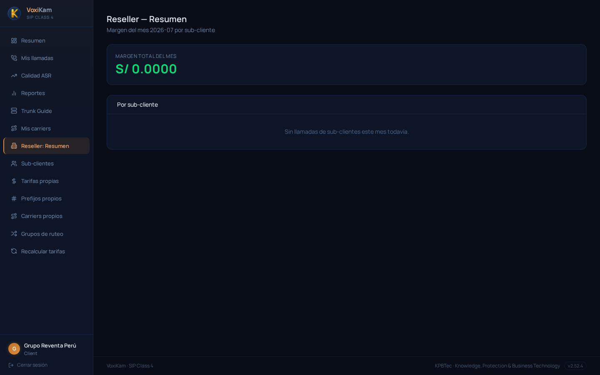
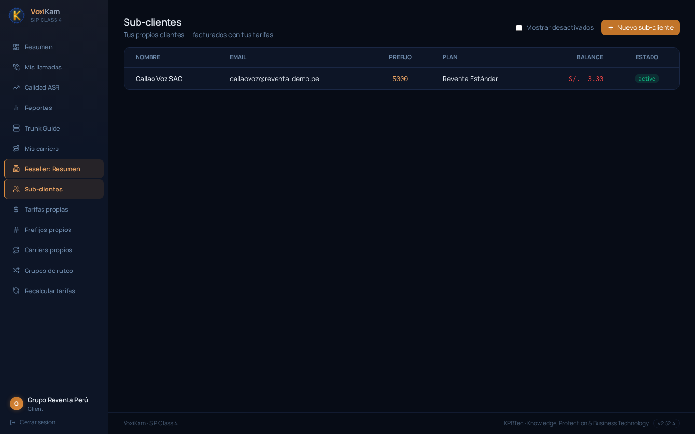
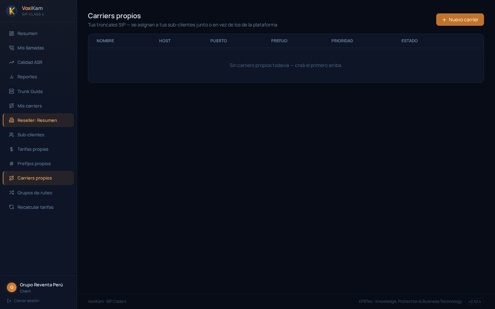
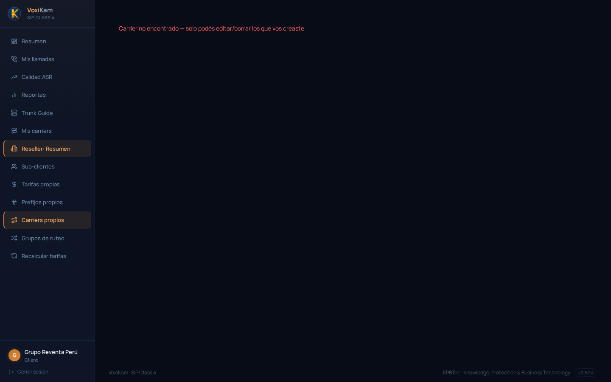
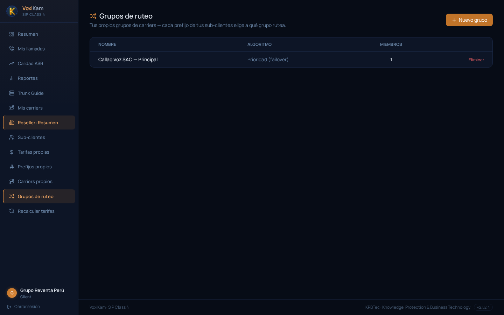
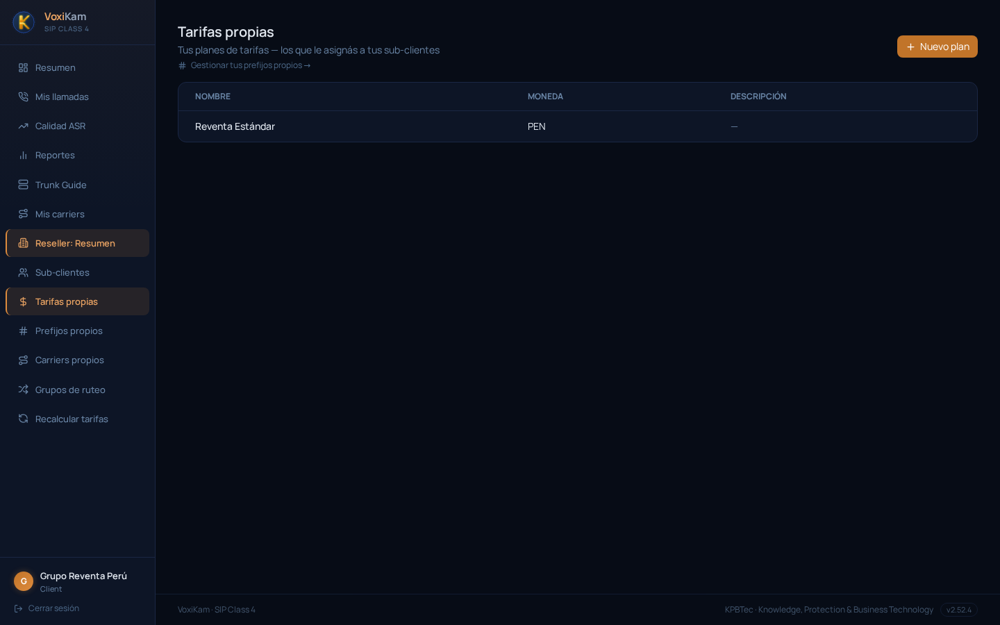
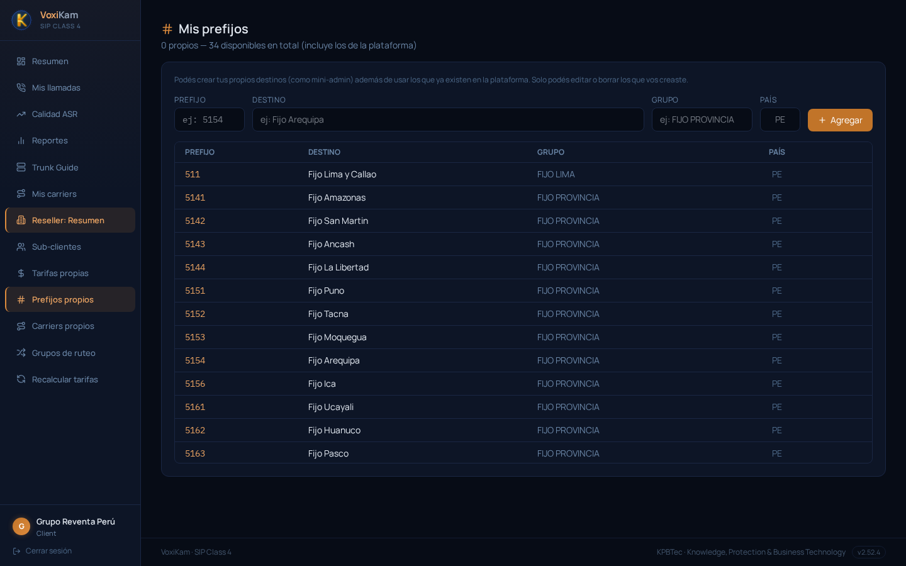
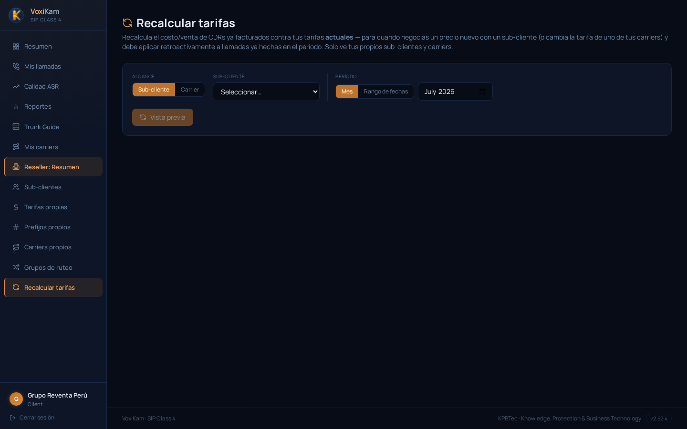

# 13. Portal del Reseller

## 13.1. Qué es un reseller y qué es el "mini-panel"

Como se explicó en el capítulo 3, cualquier cliente de VoxiKam puede marcarse como **reseller** (revendedor). Ese flag lo activa el operador de la plataforma desde el panel de administración general; el cliente no puede auto-asignárselo.

Al convertirse en reseller, ese cliente deja de ser "solo" un trunk SIP que consume el servicio: además obtiene, dentro de su propio portal de cliente, un bloque adicional de menú — una especie de **mini-VoxiKam** con alcance acotado exclusivamente a lo suyo. Desde ahí puede:

- Dar de alta y administrar sus propios **sub-clientes** (los clientes finales a los que él les revende el servicio).
- Crear sus propios **planes de tarifas** para cobrarles a esos sub-clientes.
- Opcionalmente, cargar sus propios **carriers** de salida — aunque también puede usar carriers de la plataforma si el operador se los habilitó, sin necesidad de tener infraestructura propia.
- Consultar sus propios **prefijos** o apoyarse en el catálogo de prefijos de la plataforma.
- **Recalcular tarifas** sobre sus propios sub-clientes y carriers, igual que el administrador general lo hace a nivel de toda la plataforma (capítulo 8).

La idea clave de todo este bloque es el **acotamiento**: un reseller administra un ambiente que se comporta como una versión reducida de VoxiKam, pero jamás puede ver ni modificar nada que pertenezca a otro reseller o a la plataforma en general. Esto se ve reflejado de forma muy concreta en la sección de carriers (13.3), donde el sistema bloquea explícitamente cualquier intento de tocar un recurso que no fue creado por él.

En el portal, este bloque aparece en el menú lateral bajo el encabezado **"Reseller: Resumen"**, con las entradas **Sub-clientes**, **Tarifas propias**, **Prefijos propios**, **Carriers propios**, **Grupos de ruteo** y **Recalcular tarifas**, agregadas debajo del menú normal de cliente (Resumen, Mis llamadas, Calidad ASR, Reportes, Trunk Guide, Mis carriers). Todas las capturas de este capítulo corresponden al reseller de ejemplo **Grupo Reventa Perú**.

## 13.2. Resumen

La opción **Resumen**, dentro del bloque de reseller, muestra el **margen total del mes** generado por la actividad de los sub-clientes de este reseller, y un desglose de ese margen **por sub-cliente**.

En la captura de referencia, correspondiente a **2026-07**, el margen total del mes figura en **S/. 0.0000** y la tabla de desglose por sub-cliente muestra el mensaje **"Sin llamadas de sub-clientes este mes todavía"**. Esto es esperable: es un reseller recién configurado, cuyo único sub-cliente (Callao Voz SAC, ver 13.3) todavía no cursó tráfico en el período. A medida que los sub-clientes empiecen a generar llamadas, esta pantalla va a mostrar cuánto margen deja cada uno — el equivalente, a escala de reseller, del reporte de rentabilidad por cliente que vimos en el capítulo 8 para el administrador general.

## 13.3. Sub-clientes

La opción **Sub-clientes** es el listado de los clientes propios de este reseller — "tus propios clientes, facturados con tus tarifas", como indica el subtítulo de la pantalla.

En la captura de referencia hay **un sub-cliente** dado de alta: **Callao Voz SAC**, con email `callaovoz@reventa-demo.pe`, prefijo `5000`, el plan de tarifas **"Reventa Estándar"** asignado (ver 13.5), un balance de **S/. -3.30** y estado **active**.

Desde esta pantalla el reseller puede dar de alta un **nuevo sub-cliente** (botón "Nuevo sub-cliente") y también mostrar los sub-clientes desactivados marcando la casilla correspondiente. Conceptualmente, un sub-cliente de un reseller es equivalente a un cliente normal de la plataforma: tiene su propio prefijo, su propio plan de tarifas y su propio balance — solo que quien lo administra no es el operador de VoxiKam sino el reseller, y quien le vende el servicio es el reseller y no la plataforma directamente.

## 13.4. Carriers propios

La opción **Carriers propios** lista los carriers (troncales SIP de salida) que el reseller cargó **él mismo**, para asignárselos a sus sub-clientes junto con los carriers de la plataforma, o en reemplazo de ellos.

En la captura de referencia, **Grupo Reventa Perú** todavía no tiene carriers propios: la tabla muestra **"Sin carriers propios todavía — creá el primero arriba"**. Esto no impide que el reseller rutee tráfico: si el operador de la plataforma le habilitó el uso de carriers de VoxiKam, sus sub-clientes pueden cursar llamadas por esos carriers sin que el reseller necesite dar de alta infraestructura propia. Cargar un carrier propio solo es necesario cuando el reseller tiene su propia troncal SIP para salida y quiere rutear el tráfico de sus sub-clientes por ahí.

### Control de acceso: solo lo que vos creaste

Este es el punto donde el acotamiento del mini-panel se vuelve visible de forma explícita. Si un reseller intenta acceder al detalle de un carrier que en realidad pertenece a la **plataforma** (no fue creado por él), el sistema responde con un error en vez de mostrar el detalle:

El mensaje es contundente: **"Carrier no encontrado — solo podés editar/borrar los que vos creaste"**.

Esto resume la regla de acceso de todo el panel de reseller: un reseller puede **usar** carriers de la plataforma para rutear el tráfico de sus sub-clientes (si el operador se los habilitó), pero solo puede **administrar** (ver el detalle, editar, borrar) los carriers que él mismo dio de alta. Cualquier recurso que no fue creado por el reseller queda fuera de su alcance, aunque exista y esté en uso en la plataforma — el sistema simplemente responde como si no existiera. La misma lógica de acotamiento aplica al resto de las secciones de este bloque: sub-clientes, tarifas, prefijos y grupos de ruteo propios de otro reseller son igualmente invisibles.

## 13.5. Grupos de ruteo propios

La opción **Grupos de ruteo** administra los grupos de carriers propios del reseller, usados para decidir por dónde salen las llamadas de sus sub-clientes. El subtítulo de la pantalla lo resume así: "cada prefijo de tus sub-clientes elige a qué grupo rutea".

En la captura de referencia hay **un grupo** dado de alta: **"Callao Voz SAC — Principal"**, con algoritmo **Prioridad (failover)** y **1 carrier miembro**. El concepto es el mismo que el de los grupos de ruteo a nivel de plataforma (ver capítulo de Carriers): con el algoritmo de prioridad, el sistema intenta primero el carrier de mayor prioridad dentro del grupo y solo pasa al siguiente si el primero falla. Desde esta pantalla también se puede dar de alta un **nuevo grupo** o **eliminar** uno existente.

## 13.6. Tarifas propias

La opción **Tarifas propias** lista los planes de tarifas que el reseller crea para vendérselos a sus sub-clientes — el subtítulo lo indica directamente: "los que le asignás a tus sub-clientes".

En la captura de referencia hay **un plan** dado de alta: **"Reventa Estándar"**, en moneda **PEN** (soles), sin descripción adicional. Este es justamente el plan que vimos asignado al sub-cliente Callao Voz SAC en la sección 13.3: el reseller define el precio de venta por destino en este plan propio, y luego se lo asigna a cada sub-cliente igual que el administrador general asigna planes de tarifas a sus clientes. Desde esta pantalla también se puede crear un **nuevo plan** (botón "Nuevo plan"), y hay un acceso directo a la gestión de prefijos propios ("Gestionar tus prefijos propios →"), que se detalla en la sección siguiente.

## 13.7. Mis prefijos

La opción **Prefijos propios** (identificada en el menú como "Mis prefijos") administra los destinos/prefijos que el reseller puede usar para armar sus planes de tarifas y sus reportes.

En la captura de referencia el encabezado indica **"0 propios — 34 disponibles en total (incluye los de la plataforma)"**: Grupo Reventa Perú no cargó ningún prefijo propio todavía, pero tiene acceso a los **34 prefijos** ya definidos en la plataforma (Fijo Lima y Callao, Fijo Amazonas, Fijo San Martín, Fijo Ancash, Fijo La Libertad, Fijo Puno, Fijo Tacna, Fijo Moquegua, Fijo Arequipa, Fijo Ica, Fijo Ucayali, Fijo Huánuco, Fijo Pasco, entre otros del listado). Como aclara el texto de ayuda de la pantalla, el reseller puede crear sus propios destinos "como mini-admin" además de usar los que ya existen en la plataforma, pero **solo puede editar o borrar los que él mismo creó** — la misma regla de acceso descrita en 13.4, aplicada acá a los prefijos.

Para dar de alta un prefijo propio se completan los campos **Prefijo**, **Destino**, **Grupo** y **País**, y se confirma con el botón **Agregar**.

## 13.8. Recalcular tarifas

La opción **Recalcular tarifas** es el equivalente, a nivel reseller, de la función de recálculo retroactivo que vimos para el administrador general en el capítulo 8: recalcula el costo/venta de CDRs ya facturados contra las tarifas **actuales**, para cuando se negocia un precio nuevo con un sub-cliente (o cambia la tarifa de uno de los carriers propios) y ese cambio debe aplicarse retroactivamente a llamadas que ya se cursaron en el período.

La pantalla aclara explícitamente su alcance: **"Solo ve tus propios sub-clientes y carriers"** — no se puede recalcular nada que pertenezca a otro reseller ni a la plataforma en general.

Para usarla:

1. Elegí el **alcance**: **Sub-cliente** o **Carrier**, según si el cambio de tarifa afecta el precio de venta a uno de tus sub-clientes o el costo de compra de uno de tus carriers propios.
2. Seleccioná el **sub-cliente** (o carrier, según el alcance elegido) sobre el que aplicar el recálculo.
3. Elegí el **período**, ya sea por **Mes** (en la captura de referencia, **July 2026**) o por **Rango de fechas**.
4. Generá una **Vista previa** antes de aplicar el recálculo, para revisar el impacto antes de confirmarlo de forma definitiva.
